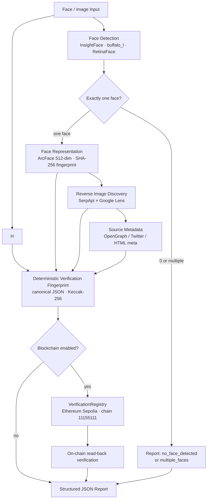

# MukhdaX

### See. Trace. Verify.

MukhdaX turns an image containing a face into a **tamper-evident provenance report**: it detects the face, derives a deterministic face representation, genuinely discovers where that image appears on the public web via Google Lens, fingerprints the whole evidence set, and can anchor the fingerprint on the Ethereum Sepolia testnet — then reads the record straight back from the chain.

It is a **verification pipeline**, not a facial-recognition or identity-matching product.

<br>


---

## The pipeline

A single input image flows through a real, multi-stage pipeline. Every stage reports its true state — including `blocked`, `failed`, or `not_run` when an external dependency is unavailable.



- **Face / Image Input** — a JPG, PNG, or WebP file.
- **Face Detection** — local, CPU-based InsightFace (`buffalo_l`); the pipeline requires **exactly one** clear face.
- **Face Representation** — a 512-dimensional ArcFace embedding, reduced to a one-way SHA-256 fingerprint; the raw embedding never leaves the machine.
- **Reverse Image Discovery** — a genuine **SerpApi × Google Lens** visual search; matching public pages are real API results, never preselected.
- **Source Metadata** — the discovered pages are fetched over HTTP and parsed for OpenGraph / Twitter / standard meta tags.
- **Verification Fingerprint** — a deterministic **Keccak-256** hash of the canonical JSON evidence payload.
- **Blockchain** — when enabled, the fingerprint is recorded on the **VerificationRegistry** contract on **Ethereum Sepolia** and verified by reading it back on-chain.

## Why MukhdaX?

Faces and images circulate far beyond their origin. MukhdaX binds a face-centered image to its public-web footprint and its on-chain record in a way that is:

- **Deterministic** — identical inputs always produce an identical verification fingerprint, so anyone can recompute and verify it.
- **Honest** — nothing is hardcoded, faked, or silently replaced. Missing keys or a failed provider are reported as such.
- **On-chain verifiable** — the fingerprint is recorded on a public testnet contract and read back independently, no credentials required.
- **Focused** — it combines face analysis, web discovery, and blockchain anchoring into one coherent provenance workflow.

## What MukhdaX is not

MukhdaX does **not** perform biometric identity verification. It does not determine whether a face belongs to a particular person, and it does not compare a face against a reference identity image.

- Face detection + face representation are **evidence components** of a provenance fingerprint.
- Google Lens matches are **reverse-image discovery evidence** — pages on which the same or a visually similar image already appears publicly. They do not prove ownership and do not prove a person's identity.

The output is a verifiable record of *the content analyzed*: which face was detected, where the image publicly matches, what metadata those pages expose, and a hash binding it all together.

## Features

- **Local face detection & representation** — InsightFace `buffalo_l` on CPU; RetinaFace-based detection and ArcFace 512-dimensional embeddings (`MODEL_NAME = "buffalo_l"`, `EMBEDDING_DIMENSION = 512`).
- **Exactly-one-face enforcement** — 0 faces or multiple faces short-circuit to an explicit report status.
- **Genuine reverse-image discovery** — real SerpApi Google Lens calls; no hardcoded or predetermined results.
- **Metadata extraction** — public source pages are parsed for canonical URL, title, description, images, dates, site name, content type, and platform.
- **Deterministic verification fingerprint** — SHA-256 for the image content and embedding; the final record hash is Keccak-256 over the canonical evidence payload.
- **Ethereum Sepolia anchoring** — real transactions; duplicate hashes rejected; read-only on-chain verification without a private key.
- **CLI + browser UI** — `face-id-verification` console command and a local FastAPI web interface drive the same pipeline.

## How it works

1. **Detect** — the face analyzer locates faces and requires exactly one. The report returns `no_face_detected` or `multiple_faces` otherwise.
2. **Represent** — the face is embedded with ArcFace into 512 dimensions; only the `SHA-256` hash of the embedding is kept.
3. **Discover** — the image bytes are sent to SerpApi's `google_lens` search. Real matching pages come back and are normalized (deduplicated, etc.). An image with no matches is a valid "no match" result.
4. **Extract** — each discovered page is fetched and parsed for standard, OpenGraph, and Twitter meta data; per-page errors are preserved, not hidden.
5. **Fingerprint** — all evidence (image content hash, face representation, reverse-search results, metadata) is serialized to deterministic canonical JSON and hashed with **Keccak-256**.
6. **Anchor** — if blockchain recording is enabled and a contract address is provided, `recordVerification(bytes32)` is called on Sepolia; a real transaction is broadcast and its receipt must report `status == 1`.
7. **Verify** — the hash is read back with `verificationExists` / `getRecord` — independent, read-only, and private-key-free.
8. **Report** — a structured JSON `VerificationReport` is printed to stdout and optionally written to `--output-dir/verification_report.json`.

## Face detection & representation

| Aspect | Implementation |
|---|---|
| Model pack | InsightFace `buffalo_l` (CPU inference) |
| Detection | RetinaFace-based detector from the pack |
| Embedding | ArcFace, **512 dimensions** |
| Exactly-one-face rule | 0 faces → `no_face_detected`; multiple → `multiple_faces`; model failure → `face_detection_failed` |
| Raw embedding | computed in memory, hashed with SHA-256 (`embedding_hash`), never stored or transmitted raw |

The embedding is **not** an identity match. It is a deterministic representation used to fingerprint the evidence set.

## Reverse image search

The default discovery path is **SerpApi × Google Lens** (`ReverseImageSearcher` = `SerpApiLensSearcher`):

- The image is compressed in memory when needed (provider limit is **500 KB**), uploaded to SerpApi, and a real `google_lens` visual search runs.
- Results come straight from the API response: pages with matching images, web entities, best-guess labels, and visually similar images. **Nothing is hardcoded or preselected.**
- A page with no public matches is reported as a valid, non-error "no match".
- Without `SERPAPI_API_KEY` the stage is truthfully reported **BLOCKED** with the underlying reason — the pipeline never pretends a search succeeded.

> Lens matches are **discovery evidence**: they show where an image publicly appears. They are not identity proof and not ownership proof.

A legacy `GoogleVisionSearcher` (Google Cloud Vision Web Detection) is still available and tested but is **not** the default provider.

## Metadata extraction

For each discovered page, MukhdaX makes a real HTTP request (user agent set, redirects followed, response size capped) and parses the HTML:

canonical URL, title, description, image URLs, `published_at` / `modified_at`, `site_name`, `og:type` content type, and platform (Instagram, Facebook, X, YouTube, TikTok, LinkedIn).

HTTP failures are mapped explicitly (`401/403`, `404/410`, `429`, `5xx`, non-HTML responses) and surfaced in the report. Only public, HTTP-reachable pages can be extracted — there is no browser automation and no login/blocker bypass.

## Verification hash

Two layers, deliberately different:

1. **Fingerprints (SHA-256)** — the raw image bytes are hashed with `hashlib.sha256` (`image_content_hash`); each face embedding similarly (`embedding_hash`). One-way digests; the image and embedding never appear raw in the report or on-chain.
2. **Verification fingerprint (Keccak-256)** — the final record hash is `Web3.keccak` of the canonical JSON payload (sorted keys, compact separators) combining the image content hash, face representation, reverse-search results, and extracted metadata. It is deterministic: anyone can recompute it from the same evidence and compare it on-chain.

**Heads-up:** the on-chain fingerprint is Keccak-256, not SHA-256. Keep the two apart.

## Blockchain

- **Network** — Ethereum **Sepolia**, chain ID **11155111**, enforced on every connection.
- **Contract** — [`VerificationRegistry.sol`](src/face_id_verification/contracts/VerificationRegistry.sol) (Solidity `^0.8.28`, bundled with the package).
- **Stored on-chain** — only the verification hash, plus the recorder address and timestamp. **No** raw embeddings, no image bytes, no search results, no credentials ever reach the chain.
- **Functions** — `recordVerification(bytes32)` (records a hash, rejects duplicates), `verificationExists(bytes32)`, and `getRecord(bytes32)` (returns `(recorder, timestamp, exists)`).
- **Duplicate protection** — recording the same payload twice is detected *before* broadcasting (`verificationExists` check); the second attempt returns `duplicate=True` with no transaction hash and spends no gas.
- **Real transactions** — when enabled, MukhdaX builds, signs, and broadcasts an actual Sepolia transaction and waits for a receipt; only `status == 1` counts as confirmed. The report carries the transaction hash, block number, and a `sepolia.etherscan.io` explorer link.

### Pre-deployed instance

A live `VerificationRegistry` is deployed on Sepolia and can be used for demos and read-back checks:

| Item | Value |
|---|---|
| Contract address | `0x76BfcB45C918C13fAAAf79D51f94fE5B29aFEB53` |
| Chain | Ethereum Sepolia · chain ID `11155111` |
| Deployment tx | `f84d9bb4eb1c2571f81fd918d5fb1b2e462a700b77938167900b8c265c1b8967` (block `11652577`) |
| Example verification tx | `caad205f4695fd67853af4ce35cd38976bb90eaf2ef644f6edda93e524272790` (block `11652599`) |
| Hash recorded there | `0x632b7ae443fa61c98c2d9d6b0ee45fe022e3c84edd1b81ed723e9fee4bbb80b3` |

Verify any hash read-only — no private key needed:

```python
from face_id_verification.blockchain_recording import verify_on_chain, get_verification_record

verify_on_chain("0x76BfcB45C918C13fAAAf79D51f94fE5B29aFEB53", "0x632b7ae4…b80b3")   # -> True
rec = get_verification_record("0x76BfcB45C918C13fAAAf79D51f94fE5B29aFEB53", "0x632b7ae4…b80b3")
print(rec.recorder, rec.timestamp, rec.exists)
```

There is **no `CONTRACT_ADDRESS` environment variable**: the address is supplied per run via `--contract-address` (CLI) or the web form. You can also deploy your own instance with `deploy_contract()` — see [docs/setup/contract.md](docs/setup/contract.md). Never commit private keys or RPC credentials.

## Example report

Illustrative example — the field structure matches the real `VerificationReport` schema (values below are placeholders, not live outputs):

```json
{
  "status": "success",
  "input_image": "sample.jpg",
  "faces": [
    {
      "bounding_box": [210, 142, 162, 198],
      "detection_confidence": 0.983,
      "embedding_hash": "0x5f3c…9a01"
    }
  ],
  "reverse_search": {
    "pages_found": 3,
    "full_matches": 2,
    "partial_matches": 1,
    "entities": [{"description": "Person", "score": 0.91}],
    "best_guess_labels": [],
    "page_urls": ["https://example.com/photo-1", "https://example.com/photo-2"]
  },
  "metadata": [
    {
      "source_url": "https://example.com/photo-1",
      "title": "Example post",
      "platform": "instagram",
      "has_error": false
    }
  ],
  "blockchain": {
    "verification_hash": "0x3f9a…e1c7",
    "transaction_hash": "0x13e0…9038",
    "block_number": 11653091,
    "confirmed": true,
    "explorer_url": "https://sepolia.etherscan.io/tx/0x13e0…9038",
    "duplicate": false
  },
  "verification_hash": "0x3f9a…e1c7",
  "errors": []
}
```

When a stage cannot run, the report says so explicitly: e.g. `reverse_search_error` describes why search was `blocked`, `blockchain_error` explains a missing key or address, and the overall `status` becomes `reverse_search_failed` / `metadata_failed`.

## Tech stack

| Area | Technology |
|---|---|
| Computer vision | InsightFace (`buffalo_l`), RetinaFace detection, ArcFace 512-dim embeddings, OpenCV, NumPy, onnxruntime |
| Reverse image search | SerpApi Google Lens API (default); Google Cloud Vision Web Detection (legacy) |
| Metadata | `requests` + standard HTML / OpenGraph / Twitter meta parsing |
| Blockchain | `web3.py`, `py-solc-x` (solc 0.8.28), Solidity `^0.8.28`, Ethereum Sepolia |
| Backend / core | Python 3.10+, FastAPI, uvicorn, python-multipart |
| Testing | pytest (unit + credential-gated integration) |
| Packaging | setuptools / `pyproject.toml`, console script `face-id-verification` |

## Getting started

### 1. Clone

```bash
git clone https://github.com/ANUBprad/face-id-verification.git
cd face-id-verification
```

### 2. Environment

Python **3.10+**. Create a virtual environment, then install:

```bash
python -m venv .venv
# Windows: .venv\Scripts\activate    |    macOS/Linux: source .venv/bin/activate
pip install -e .
```

For development/testing: `pip install -e ".[dev]"`.

On first face-detection run, InsightFace downloads the `buffalo_l` model pack (needs network; then cached locally). The package bundles the Solidity contract and the web UI, so no extra build step is required.

### 3. Configuration

Secrets are read from environment variables at runtime. Never commit real values.

| Variable | Used by | Notes |
|---|---|---|
| `SERPAPI_API_KEY` | reverse image search (default provider) | SerpApi Google Lens key; missing → stage reported **BLOCKED** |
| `SEPOLIA_RPC_URL` | blockchain recording / read-back | HTTPS Sepolia RPC endpoint |
| `SEPOLIA_PRIVATE_KEY` | blockchain recording / deployment | Sepolia-only test account funded with test ETH |
| `GOOGLE_APPLICATION_CREDENTIALS` | *legacy* reverse-search provider only | Path to GCP service-account JSON for the optional `GoogleVisionSearcher` |
| `SEPOLIA_CONTRACT_ADDRESS` | **test-suite only** | Optional: override of the integration-test deployment address |

The web server's host/port are `FACE_ID_WEB_HOST` / `FACE_ID_WEB_PORT` (defaults `127.0.0.1:8000`). Copy [`.env.example`](.env.example) and fill what you need.

### 4. Run — no credentials needed

Every local stage runs; external stages report their true state (`blocked` / `disabled`):

```bash
face-id-verification --image sample.jpg --output-dir output --skip-blockchain
```

### 5. Run — full on-chain pipeline

```bash
face-id-verification --image sample.jpg --output-dir output \
  --contract-address 0x76BfcB45C918C13fAAAf79D51f94fE5B29aFEB53
```

Requires `SEPOLIA_RPC_URL` and `SEPOLIA_PRIVATE_KEY` with test ETH, and a reachable SerpApi key.

### 6. Web interface

```bash
python -m face_id_verification.web
```

Open `http://127.0.0.1:8000`, drop in an image (up to 10 MB), optionally enable Blockchain with the contract address, and watch each stage report its real state → ending in the JSON report and, when enabled, the on-chain record.

## CLI reference

```bash
face-id-verification --help          # or: python -m face_id_verification.cli --help
```

| Option | Description |
|---|---|
| `--image PATH` | (required) input image file |
| `--output-dir PATH` | directory to write `verification_report.json` |
| `--skip-blockchain` | disable on-chain recording |
| `--contract-address ADDR` | deployed `VerificationRegistry` address (checksum-validated) |
| `--timeout SECONDS` | timeout for external operations (default `30`) |
| `--verbose` | diagnostic logging to stderr (stdout stays clean JSON) |
| `--version` | print version (`0.1.0`) |

Exit codes:

| Code | Meaning |
|---|---|
| `0` | verification succeeded |
| `1` | usage or unexpected error |
| `2` | face detection failed / no face / multiple faces |
| `3` | reverse image search failed |
| `4` | metadata extraction failed |
| `5` | blockchain enabled but not configured (missing `--contract-address` or Sepolia env vars) |

Running without `--skip-blockchain` and without `--contract-address` exits with `5` and explains why, e.g.:

```json
{"error": "Blockchain enabled but --contract-address not provided"}
```

The report is printed as JSON on stdout; with `--verbose` diagnostics go to stderr.

## What a judge sees (demo flow)

```
$ face-id-verification --image sample.jpg --output-dir output \
    --contract-address 0x76BfcB45C918C13fAAAf79D51f94fE5B29aFEB53
```

1. **Face detected** — one face located, bounding box + detection confidence in the report.
2. **Google Lens discovery** — the image is genuinely searched; real matching public pages are returned.
3. **Metadata extracted** — titles, platforms, and timestamps pulled from each reachable source page.
4. **Verification fingerprint generated** — a deterministic Keccak-256 hash over the evidence.
5. **Sepolia transaction submitted** — `recordVerification(bytes32)` broadcast for real.
6. **Transaction confirmed** — receipt `status == 1`; report includes the transaction hash, block number, and an Etherscan explorer link.
7. **On-chain verification** — the hash is read back with `verificationExists`/`getRecord` (read-only).
8. **JSON report produced** — written to `output/verification_report.json`.

No credentials → the same flow still runs and spends nothing: reverse search reports **BLOCKED**, blockchain is **DISABLED** (`--skip-blockchain`), and the rest of the pipeline operates normally.

## Testing

```bash
python -m pytest -q                 # full suite
python -m pytest -m integration -q -ra   # credential-gated integration tests
```

Current state:

- **Full suite**: `308 passed, 9 skipped, 0 failed`.
- **Live integration validation** (with real credentials configured): `10 passed, 3 skipped, 0 failed`.

The remaining three skips are legacy **Google Cloud Vision** integration tests that require Application Default Credentials — credential-gating, not failures. SerpApi integration tests need `SERPAPI_API_KEY`; Sepolia tests need `SEPOLIA_RPC_URL` + `SEPOLIA_PRIVATE_KEY`.

## Project structure

The project deliberately keeps a **single flat package** — audited and deemed appropriate for this scope; there is no over-engineered layered architecture.

```
src/face_id_verification/
├── cli.py                     # command-line interface (argparse, exit codes)
├── pipeline.py                # VerificationPipeline orchestration + VerificationReport
├── face_detection.py          # InsightFace buffalo_l detection + 512-d embeddings
├── reverse_search.py          # SerpApi Google Lens (default) + legacy GCV clients
├── metadata_extraction.py     # HTTP fetch + OpenGraph/Twitter meta parsing
├── blockchain_recording.py    # Sepolia deployment, recording, on-chain verification
├── py.typed
├── contracts/
│   └── VerificationRegistry.sol
└── web/
    ├── app.py                 # FastAPI app (browser UI + /api/verify)
    ├── state.py               # truthful per-stage state derivation
    ├── __main__.py            # uvicorn entry point
    └── static/index.html

tests/                         # unit/behavior tests + credential-gated integration tests
docs/
├── setup/serpapi.md           # SerpApi Google Lens (default) credentials setup
├── setup/gcp.md               # Google Cloud Vision legacy credentials setup
├── setup/sepolia.md           # RPC + test ETH setup
├── setup/contract.md          # contract deployment + pre-deployed instance
└── troubleshooting.md

EXTERNAL_SETUP.md              # provider rationale, design, and failure philosophy
pyproject.toml                 # package metadata, dependencies, pytest config
.env.example                   # supported environment variables (placeholders only)
```

## Security & privacy

- Face detection and embedding run **locally** on CPU.
- Blockchain payloads contain only the verification hash, recorder, and timestamp — **no** raw embeddings, no image bytes, and no credentials.
- Secrets are read from environment variables at runtime; `.env` files are gitignored, and no secret-bearing files are tracked.
- The web server is for **local/demo use**: no authentication, binds to localhost by default.

These are real protections, but absolute privacy is not claimed: reverse-search and metadata steps necessarily send an image/URL to external services, and on-chain data is public by design.

## Limitations

- **Not biometric identity verification** — face analysis and Lens matches are evidence components, not identity proof.
- Reverse-search results depend on the provider's index and require `SERPAPI_API_KEY`; a genuine no-match is a valid result.
- Metadata is only available for public, HTTP-reachable pages; extraction respects redirects, size caps, and explicit HTTP error boundaries.
- Blockchain recording and deployment require a funded Sepolia account (`SEPOLIA_PRIVATE_KEY` + `SEPOLIA_RPC_URL`); test ETH has no real-world value.
- The production pipeline requires a clear, (near-)frontal image with **exactly one** face.
- The legacy Google Cloud Vision provider is tested but not the default; using it requires a billable GCP project.
- The repository intentionally bundles no sample images — provide your own (tests download fixtures at runtime).

## Roadmap

Planned as *future work* — none of this exists yet:

- Additional reverse-search providers (multi-engine discovery and comparison).
- Richer provenance visualization (evidence graph linking pages, metadata, and chain records).
- Stronger source ranking/trust scoring for discovered pages.
- Production-chain (mainnet) support with the same read-back semantics.
- Optional decentralized report/reference storage (e.g., IPFS or Arweave) linked from the verification record.

## Development

- [AGENTS.md](AGENTS.md) states the project's engineering rules — read it before contributing.
- Keep changes verified: `python -m pytest -q` before committing.
- No CI pipeline is configured in the repository; pull requests are validated locally.

## License

[MIT](LICENSE)