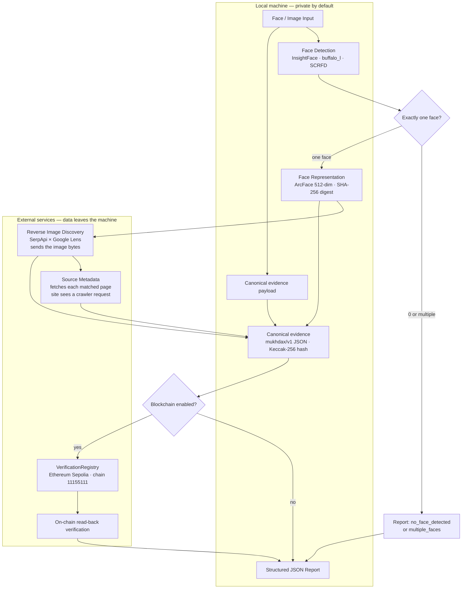

# MukhdaX

### See. Trace. Verify.

MukhdaX turns an image containing a face into a **tamper-evident provenance report**: it detects the face, derives a fixed-length face representation, genuinely discovers where that image appears on the public web via Google Lens, commits the whole evidence set to a single hash under an explicit versioned schema, and can anchor that hash on the Ethereum Sepolia testnet — then reads the record straight back from the chain.

It is a **verification pipeline**, not a facial-recognition or identity-matching product.

<br>


---

## The pipeline

A single input image flows through a real, multi-stage pipeline. Every stage reports its true state — including `blocked`, `failed`, or `not_run` when an external dependency is unavailable.


```mermaid
flowchart TD
    A[Face / Image Input] --> B[Face Detection<br/>InsightFace · buffalo_l · SCRFD]
    B --> C{Exactly one face?}
    C -->|0 or multiple| E1[Report: no_face_detected<br/>or multiple_faces]
    C -->|one face| D[Face Representation<br/>ArcFace 512-dim · SHA-256 digest]
    A --> H
    D --> R
    R --> M
    H & D & R & M --> V[Canonical evidence<br/>mukhdax/v1 JSON · Keccak-256 hash]
    V --> B1{Blockchain enabled?}
    B1 -->|yes| S[VerificationRegistry<br/>Ethereum Sepolia · chain 11155111]
    S --> O[On-chain read-back verification]
    B1 -->|no| Z[Structured JSON Report]
    O --> Z
    E1 --> Z

    subgraph LOCAL["Local machine — private by default"]
        A
        B
        D
        H[Canonical evidence payload]
        V
        Z
    end

    subgraph EXT["External services — data leaves the machine"]
        R[Reverse Image Discovery<br/>SerpApi × Google Lens<br/>sends the image bytes]
        M[Source Metadata<br/>fetches each matched page<br/>site sees a crawler request]
        S
        O
    end
```

- **Face / Image Input** — a JPG, PNG, or WebP file.
- **Face Detection** — local, CPU-based InsightFace (`buffalo_l`); the pipeline requires **exactly one** clear face.
- **Face Representation** — a 512-dimensional ArcFace embedding, reduced to a one-way SHA-256 digest; the raw embedding never leaves the machine.
- **Reverse Image Discovery** — a genuine **SerpApi × Google Lens** visual search; the image bytes are uploaded to SerpApi, and matching public pages are real API results, never preselected.
- **Source Metadata** — the discovered pages are fetched over HTTP and parsed for OpenGraph / Twitter / standard meta tags; each target site sees an ordinary crawler request.
- **Canonical evidence / verification hash** — a versioned (`mukhdax/v1`) **Keccak-256** hash over a canonical, integer-only JSON evidence payload. The full evidence set stays local; only this 32-byte hash can be anchored.
- **Blockchain** — when enabled, the verification hash is recorded on the **VerificationRegistry** contract on **Ethereum Sepolia** and verified by reading it back on-chain.

The two boxes are the trust boundary that matters: the image bytes cross to a third-party search provider, and a single 32-byte hash crosses to a public chain. Everything in the face-analysis and hashing path stays on your machine. See [Security & privacy](#security--privacy) for the full data-flow table.

## Why MukhdaX?

Faces and images circulate far beyond their origin. MukhdaX binds a face-centered image to its public-web footprint and its on-chain record in a way that is:

- **Reproducible** — the same canonical evidence object always yields the same verification hash, because the payload is serialized by an explicit, versioned rule instead of by accident. This is a guarantee about *serialization*, not about model inference — see [Limitations](#determinism-limitations).
- **Honest** — nothing is hardcoded, faked, or silently replaced. Missing keys or a failed provider are reported as such.
- **On-chain verifiable** — the verification hash is recorded on a public testnet contract and can be read back independently by anyone with an RPC endpoint; no private key is needed to look it up.
- **Focused** — it combines face analysis, web discovery, and blockchain anchoring into one coherent provenance workflow.

## What MukhdaX is not

MukhdaX does **not** perform biometric identity verification. It does not determine whether a face belongs to a particular person, and it does not compare a face against a reference identity image.

- Face detection + face representation are **evidence components** of the verification hash, not identity proof on their own.
- Google Lens matches are **reverse-image discovery evidence** — pages on which the same or a visually similar image already appears publicly. They do not prove ownership and do not prove a person's identity.

The output is a verifiable record of *the content analyzed*: which face was detected, where the image publicly matches, what metadata those pages expose, and a hash binding it all together.

## Features

- **Local face detection & representation** — InsightFace `buffalo_l` on CPU; SCRFD detection and ArcFace 512-dimensional embeddings (`MODEL_NAME = "buffalo_l"`, `EMBEDDING_DIMENSION = 512`).
- **Exactly-one-face enforcement** — 0 faces or multiple faces short-circuit to an explicit report status.
- **Genuine reverse-image discovery** — real SerpApi Google Lens calls; no hardcoded or predetermined results.
- **Metadata extraction** — public source pages are parsed for canonical URL, title, description, images, dates, site name, content type, and platform.
- **Versioned canonical evidence** — SHA-256 for the image content and embedding; the final record hash is Keccak-256 over the versioned `mukhdax/v1` canonical evidence payload.
- **Ethereum Sepolia anchoring** — real transactions; a duplicate hash is detected before a transaction is sent, so nothing is broadcast and no gas is spent; read-only on-chain verification without a private key.
- **CLI + browser UI** — `face-id-verification` console command and a local FastAPI web interface drive the same pipeline.

## How it works

1. **Detect** — the face analyzer locates faces and requires exactly one. The report returns `no_face_detected` or `multiple_faces` otherwise.
2. **Represent** — the face is embedded with ArcFace into 512 dimensions; only the `SHA-256` hash of the embedding is kept.
3. **Discover** — the image bytes are sent to SerpApi's `google_lens` search. Real matching pages come back and are normalized (deduplicated, etc.). An image with no matches is a valid "no match" result.
4. **Extract** — each discovered page is fetched and parsed for standard, OpenGraph, and Twitter meta data; per-page errors are preserved, not hidden.
5. **Commit** — all evidence (image content hash, face representation, reverse-search results, metadata) is serialized to versioned `mukhdax/v1` canonical JSON and hashed with **Keccak-256** into a single verification hash.
6. **Anchor** — if blockchain recording is enabled and a contract address is provided, the hash is first checked with `verificationExists`; if it is not already on-chain, `recordVerification(bytes32)` is called on Sepolia, a real transaction is broadcast, and its receipt must report `status == 1`. If the hash *is* already recorded, nothing is broadcast — the report carries `duplicate: true` and no transaction hash.
7. **Verify** — the hash is read back with `verificationExists` / `getRecord` — independent, read-only, and private-key-free.
8. **Report** — a structured JSON `VerificationReport` is printed to stdout and optionally written to `--output-dir/verification_report.json`.

## Face detection & representation

| Aspect | Implementation |
|---|---|
| Model pack | InsightFace `buffalo_l` (CPU inference) |
| Detection | SCRFD detector from the pack (`det_10g.onnx`) |
| Embedding | ArcFace, **512 dimensions** |
| Exactly-one-face rule | 0 faces → `no_face_detected`; multiple → `multiple_faces`; model failure → `face_detection_failed` |
| Raw embedding | computed in memory, hashed with SHA-256 (`embedding_hash`), never stored or transmitted raw |

The embedding is **not** an identity match. It is a fixed-length representation used to commit to the evidence set; note that model inference is not guaranteed bit-identical across environments.

## Reverse image search

The default discovery path is **SerpApi × Google Lens** (`ReverseImageSearcher` = `SerpApiLensSearcher`):

- The image is compressed in memory when needed (provider limit is **500 KB**), uploaded to SerpApi, and a real `google_lens` visual search runs.
- Results come straight from the API response: pages with matching images, the visually matching images found on them, and the images the provider flags as exact matches. **Nothing is hardcoded or preselected.**
- Provider ranking is preserved, never sorted. Pages are deduplicated by URL and images by image URL, keeping each first occurrence.
- A page with no public matches is reported as a valid, non-error "no match".
- Without `SERPAPI_API_KEY` the stage is truthfully reported **BLOCKED** with the underlying reason — the pipeline never pretends a search succeeded.

What the default SerpApi provider does **not** return, and therefore never reports:

| Report field | SerpApi Google Lens |
| --- | --- |
| `pages_with_matching_images` | supported - from `visual_matches[].link` / `title` |
| `visually_similar_images` | supported - from `visual_matches[].image` |
| `full_matching_images` | supported - images the provider itself flags `exact_matches`, plus the dedicated `exact_matches` section |
| `partial_matching_images` | **never populated** - Google Lens has no partial-match concept |
| `web_entities` | **never populated** - Lens returns no entity descriptions or scores |
| `best_guess_labels` | **never populated** - Lens returns no labels; page titles and related search queries are not labels |

These three are Google Cloud Vision concepts, not Lens ones. Deriving them from titles, domains, or related queries would mislabel evidence, so they stay empty rather than being guessed. `web_entities` is left empty partly because Lens gives no confidence score, and `mukhdax/v1` canonicalizes an entity score into `score_ppm` - inventing a number there would fabricate evidence.

Two further provider limits worth knowing:

- The search request sends `engine=google_lens`, the uploaded `image_id`, and the API key. MukhdaX does **not** send a `type` parameter, so the response is whatever SerpApi returns by default for that engine — the **Visual Matches** view. The dedicated Exact Matches view is a separate request that the pipeline does not make, so exact-match evidence comes from the per-result `exact_matches` flag rather than a second billable call.
- Lens returns related search queries (with Google search links). They are not pages containing the image, so they are not reported as matches.

> Lens matches are **discovery evidence**: they show where an image publicly appears. They are not identity proof and not ownership proof.

A legacy `GoogleVisionSearcher` (Google Cloud Vision Web Detection) is still available and tested but is **not** the default provider. It is the only provider that populates `partial_matching_images`, `web_entities`, and `best_guess_labels`, because those are Cloud Vision response concepts. `google-cloud-vision` is an optional extra: install it with `pip install "face-id-verification[gcv]"` (or `pip install -e ".[gcv]"` from a checkout). Without it the rest of the package, including the default SerpApi provider, works normally, and constructing the GCV searcher raises an error naming the extra to install.

## Metadata extraction

For each discovered page, MukhdaX makes a real HTTP request (user agent set, redirects followed, response size capped) and parses the HTML:

canonical URL, title, description, image URLs, `published_at` / `modified_at`, `site_name`, `og:type` content type, and platform (Instagram, Facebook, X, YouTube, TikTok, LinkedIn).

HTTP failures are mapped explicitly (`401/403`, `404/410`, `429`, `5xx`, non-HTML responses) and surfaced in the report. Only public, HTTP-reachable pages can be extracted — there is no browser automation and no login/blocker bypass.

## Verification hash

Two layers, deliberately different:

1. **Fingerprints (SHA-256)** — the raw image bytes are hashed with `hashlib.sha256` (`image_content_hash`); each face embedding similarly (`embedding_hash`). One-way digests; the image and embedding never appear raw in the report or on-chain.
2. **Verification hash (Keccak-256)** — the final record hash is `Web3.keccak` over the canonical JSON encoding of the evidence payload.

### Canonical schema `mukhdax/v1`

The payload is built by `src/face_id_verification/verification_hash.py` under an explicit, versioned contract:

| Rule | Value |
| --- | --- |
| Schema identifier | `"schema": "mukhdax/v1"` |
| Key order | ascending, `sort_keys=True` |
| Separators | `,` and `:` with no whitespace |
| Encoding | `ensure_ascii=True` — every non-ASCII character is escaped |
| Numbers | **integers only**; no float is ever serialized |
| `null` | used for absent optional values; the `reverse_search` key is always present and is `null` when the search did not run |
| Bounding box | `[x1, y1, x2, y2]`, absolute source pixels, integers |
| Confidence | `detection_confidence_ppm` / `score_ppm` — `round(value × 1_000_000)`, clamped to `0…1_000_000` |
| Evidence order | preserved, not sorted — `faces`, `page_urls`, `best_guess_labels`, `entities` and `metadata` are ranked or positional, so reordering them would change their meaning |

**Included:** `schema`, `image_content_hash`, per-face `bounding_box` / `detection_confidence_ppm` / `embedding_hash`, reverse-search counts, entity descriptions and `score_ppm`, best-guess labels, page URLs, and per-URL metadata (`source_url`, `title`, `platform`, `has_error`).

**Report-only:** individual `full_matching_images`, `partial_matching_images`, and `visually_similar_images` URLs are reported but not serialized individually — v1 serializes only the `full_matches` / `partial_matches` **counts** and the ordered `page_urls`. `page_title` is likewise excluded, since it is presentation text.

Because the counts are part of the hashed evidence, a run whose provider reports exact matches hashes differently from an otherwise identical run whose provider reports none. The schema meaning is unchanged; only the evidence differs. Adding image URLs to v1 would require a `mukhdax/v2` decision.

**Excluded by construction:** local file paths, execution timestamps, RPC endpoints, transaction hashes, block numbers, machine details, and error text.

**Heads-up:** the on-chain verification hash is Keccak-256, not SHA-256. Keep the two apart: the SHA-256 digests are internal evidence components, the Keccak-256 hash is the record.

### Legacy records

Records written before schema versioning were produced by the **same Keccak-256 digest** applied to an older, unversioned payload shape. The distinction is therefore the **payload shape**, not a different cryptographic algorithm: those digests are not rewritten and not invalidated, and `compute_legacy_verification_hash()` still reproduces them exactly, so historical on-chain records remain interpretable.

The production pipeline emits `mukhdax/v1` and nothing else; the report's `verification_schema` field therefore reads `mukhdax/v1` for every run the pipeline performs. `mukhdax/legacy-unversioned` appears only when a caller deliberately builds a report from `compute_legacy_verification_hash()` (or passes the constant through), which is a compatibility path for historical digests, not a pipeline mode.

The contract stores a bare `bytes32` and no schema tag, so a legacy record and a `mukhdax/v1` record are **indistinguishable from the chain alone** — the distinction lives in the report, not on-chain.

### Determinism limitations

Canonical serialization is deterministic. **Model inference is not guaranteed to be.** Specifically:

- `embedding_hash` is a SHA-256 digest of an ArcFace embedding produced by InsightFace and ONNX Runtime. That inference can shift across library versions, CPU instruction sets, or thread counts, so the same photograph is **not** guaranteed to yield the same verification hash on a different machine. Versioning the serialization cannot fix this.
- Unicode is escaped, not normalized. Precomposed `Ü` and `U` + combining diaeresis are distinct byte sequences and produce different verification hashes.
- Evidence ordering is preserved because it is meaningful. Re-running a reverse-image search later may legitimately return the same evidence in a different rank, which changes the verification hash even though the subject is unchanged.
- Search and metadata results are **live web data** and drift over time. A verification hash therefore attests to *the evidence as observed at that time*, not to a permanently stable fact.

## Blockchain

- **Network** — Ethereum **Sepolia**, chain ID **11155111**, enforced on every connection.
- **Contract** — [`VerificationRegistry.sol`](src/face_id_verification/contracts/VerificationRegistry.sol) (Solidity `^0.8.28`, bundled with the package, together with its compiled ABI).
- **Stored on-chain** — only the verification hash, plus the recorder address and timestamp. **No** raw embeddings, no image bytes, no search results, no credentials ever reach the chain.
- **Functions** — `recordVerification(bytes32)` (records a hash), `verificationExists(bytes32)`, and `getRecord(bytes32)` (returns `(recorder, timestamp, exists)`).
- **Duplicate protection** — two layers, and it is worth keeping them apart:
  - *Client behaviour (what a MukhdaX run does).* Before broadcasting anything, `record_verification()` calls `verificationExists` for the hash. If it is already recorded, the call returns `duplicate=True` with `transaction_hash: null` and `block_number: null`: **no transaction is signed or sent, and MukhdaX spends no gas.** The run then continues to the read-back step, which re-reads the existing record and confirms it, so a repeated verification is reported as complete rather than as an error.
  - *Contract-level protection (what the chain enforces).* `recordVerification` also carries `require(!records[verificationHash].exists, "Hash already recorded")`, so a duplicate submitted by any other client — including a future MukhdaX release — reverts on-chain instead of overwriting the original record.
- **Real transactions** — when enabled, MukhdaX builds, signs, and broadcasts an actual Sepolia transaction and waits for a receipt; only `status == 1` counts as confirmed. The report carries the transaction hash, block number, and a `sepolia.etherscan.io` explorer link.

### Pre-deployed instance

A live `VerificationRegistry` is deployed on Sepolia and can be used for demos and read-back checks:

| Item | Value |
|---|---|
| Contract address | `0x76BfcB45C918C13fAAAf79D51f94fE5B29aFEB53` |
| Chain | Ethereum Sepolia · chain ID `11155111` |
| Deployment tx | `f84d9bb4eb1c2571f81fd918d5fb1b2e462a700b77938167900b8c265c1b8967` (block `11652577`) |
| Example verification tx | `caad205f4695fd67853af4ce35cd38976bb90eaf2ef644f6edda93e524272790` (block `11652599`) |
| Hash recorded there | `0x632b7ae443fa61c98c2d9d6b0ee45fe022e3c84edd1b81ed723e9fee4bbb80b3` |

Verify any hash read-only — no private key needed:

```python
from face_id_verification.blockchain_recording import verify_on_chain, get_verification_record

verify_on_chain("0x76BfcB45C918C13fAAAf79D51f94fE5B29aFEB53", "0x632b7ae4…b80b3")   # -> True
rec = get_verification_record("0x76BfcB45C918C13fAAAf79D51f94fE5B29aFEB53", "0x632b7ae4…b80b3")
print(rec.recorder, rec.timestamp, rec.exists)
```

There is **no `CONTRACT_ADDRESS` environment variable**: the address is supplied per run via `--contract-address` (CLI) or the web form. You can also deploy your own instance with `deploy_contract()` — see [docs/setup/contract.md](docs/setup/contract.md). Never commit private keys or RPC credentials.

## Example report

Illustrative example — the field structure matches the real `VerificationReport` schema (values below are placeholders, not live outputs). The `reverse_search` block is shown in its canonical `mukhdax/v1` form; with the default SerpApi provider `partial_matches` is `0` and `entities` is `[]`, because Google Lens supplies neither:

```json
{
  "status": "success",
  "input_image": "sample.jpg",
  "faces": [
    {
      "bounding_box": [210, 142, 162, 198],
      "detection_confidence": 0.983,
      "embedding_hash": "0x5f3c…9a01"
    }
  ],
  "reverse_search": {
    "pages_found": 3,
    "full_matches": 2,
    "partial_matches": 0,
    "entities": [],
    "best_guess_labels": [],
    "page_urls": ["https://example.com/photo-1", "https://example.com/photo-2"]
  },
  "metadata": [
    {
      "source_url": "https://example.com/photo-1",
      "title": "Example post",
      "platform": "instagram",
      "has_error": false
    }
  ],
  "blockchain": {
    "verification_hash": "0x3f9a…e1c7",
    "transaction_hash": "0x13e0…9038",
    "block_number": 11653091,
    "confirmed": true,
    "explorer_url": "https://sepolia.etherscan.io/tx/0x13e0…9038",
    "duplicate": false
  },
  "verification_hash": "0x3f9a…e1c7",
  "verification_schema": "mukhdax/v1",
  "blockchain_readback": {
    "verification_hash": "0x3f9a…e1c7",
    "exists": true,
    "verified": true,
    "recorder": "0xab…ef",
    "timestamp": 1757000000
  },
  "errors": []
}
```

When a stage cannot run, the report says so explicitly: e.g. `reverse_search_error` describes why search was `blocked`, `blockchain_error` explains a missing key or address, and the overall `status` becomes `reverse_search_failed` / `metadata_failed`.

## Tech stack

| Area | Technology |
|---|---|
| Computer vision | InsightFace (`buffalo_l`), SCRFD detection, ArcFace 512-dim embeddings, OpenCV, NumPy, onnxruntime |
| Reverse image search | SerpApi Google Lens API (default); Google Cloud Vision Web Detection (legacy) |
| Metadata | `requests` + standard HTML / OpenGraph / Twitter meta parsing |
| Blockchain | `web3.py`, packaged contract ABI, Solidity `^0.8.28`, Ethereum Sepolia |
| Backend / core | Python 3.10+, FastAPI, uvicorn, python-multipart |
| Testing | pytest (unit + credential-gated integration) |
| Packaging | setuptools / `pyproject.toml`, console script `face-id-verification`, checked-in contract ABI |

## Getting started

### 1. Clone

```bash
git clone https://github.com/ANUBprad/face-id-verification.git
cd face-id-verification
```

### 2. Environment

Python **3.10+**. Create a virtual environment, then install:

```bash
python -m venv .venv
# Windows: .venv\Scripts\activate    |    macOS/Linux: source .venv/bin/activate
pip install -e .
```

For development/testing: `pip install -e ".[dev]"`.

The install modes that exist are:

| Command | What it adds |
| --- | --- |
| `pip install .` | Base install. Verification, recording, and on-chain read-back all work. |
| `pip install ".[gcv]"` | The legacy Google Cloud Vision search provider. |
| `pip install ".[contract]"` | A Solidity compiler, needed **only** to deploy the contract. |
| `pip install -e ".[dev]"` | Development and test tooling. |

**A base install has no Solidity compiler.** Recording a verification and reading it back use the contract ABI packaged with MukhdaX, so they need no solc, no download, and no build step. Deploying `VerificationRegistry` is the one operation that must compile, because it is the only one that needs bytecode; without the `contract` extra it fails with a message naming the extra to install. See `docs/setup/contract.md`.

Google Cloud Vision is likewise **not** a runtime dependency. It is only needed for the legacy `GoogleVisionSearcher` provider, which is not the default (the default is SerpApi Google Lens). If you want it:

```bash
pip install -e ".[gcv]"
```

On first face-detection run, InsightFace downloads the `buffalo_l` model pack (needs network; then cached locally). The package bundles the Solidity contract, its compiled ABI, and the web UI, so no extra build step is required.

### 3. Configuration

Secrets are read from environment variables at runtime. Never commit real values.

| Variable | Used by | Notes |
|---|---|---|
| `SERPAPI_API_KEY` | reverse image search (default provider) | SerpApi Google Lens key; missing → stage reported **BLOCKED** |
| `SEPOLIA_RPC_URL` | blockchain recording / read-back | HTTPS Sepolia RPC endpoint |
| `SEPOLIA_PRIVATE_KEY` | blockchain recording / deployment | Sepolia-only test account funded with test ETH |
| `GOOGLE_APPLICATION_CREDENTIALS` | *legacy* reverse-search provider only | Path to GCP service-account JSON for the optional `GoogleVisionSearcher`. MukhdaX never reads this variable itself — the Google SDK resolves it. |
| `SEPOLIA_CONTRACT_ADDRESS` | **test-suite only** | Optional: override of the integration-test deployment address |

The web server's host/port are `FACE_ID_WEB_HOST` / `FACE_ID_WEB_PORT` (defaults `127.0.0.1:8000`). Copy [`.env.example`](.env.example) and fill what you need.

**How those variables get loaded.** The CLI (`face-id-verification` or `python -m face_id_verification.cli`) and the web server (`python -m face_id_verification.web`) each call `load_local_config()` at startup. It prefers the `.env` next to the project root, falls back to a `.env` discovered by walking up from the current directory, and deliberately ignores a `.env` from an unrelated directory. Variables already set in the environment are never overwritten. Direct library use gets **none** of that: calling `VerificationPipeline().verify("photo.jpg")` yourself reads the **process environment only**, unless you call `load_local_config()` first.

### 4. Run — no credentials needed

Every local stage runs; external stages report their true state (`blocked` / `disabled`):

```bash
face-id-verification --image sample.jpg --output-dir output --skip-blockchain
```

### 5. Run — full on-chain pipeline

```bash
face-id-verification --image sample.jpg --output-dir output \
  --contract-address 0x76BfcB45C918C13fAAAf79D51f94fE5B29aFEB53
```

Requires `SEPOLIA_RPC_URL` and `SEPOLIA_PRIVATE_KEY` with test ETH, and a reachable SerpApi key.

### 6. Web interface

```bash
python -m face_id_verification.web
```

Open `http://127.0.0.1:8000`, drop in an image (up to 10 MB), optionally enable Blockchain with the contract address, and watch each stage report its real state → ending in the JSON report and, when enabled, the on-chain record.

## CLI reference

```bash
face-id-verification --help          # or: python -m face_id_verification.cli --help
```

| Option | Description |
|---|---|
| `--image PATH` | (required) input image file |
| `--output-dir PATH` | directory to write `verification_report.json` |
| `--skip-blockchain` | disable on-chain recording |
| `--contract-address ADDR` | deployed `VerificationRegistry` address (checksum-validated) |
| `--timeout SECONDS` | timeout for external operations (default `30`) |
| `--verbose` | diagnostic logging to stderr (stdout stays clean JSON) |
| `--version` | print version (`0.1.0`) |

Exit codes:

| Code | Meaning |
|---|---|
| `0` | verification succeeded |
| `1` | usage or unexpected error |
| `2` | face detection failed / no face / multiple faces |
| `3` | reverse image search failed |
| `4` | metadata extraction failed |
| `5` | blockchain enabled but not configured (missing `--contract-address` or Sepolia env vars) |

Running without `--skip-blockchain` and without `--contract-address` exits with `5` and explains why, e.g.:

```json
{"error": "Blockchain enabled but --contract-address not provided"}
```

The report is printed as JSON on stdout; with `--verbose` diagnostics go to stderr.

## What a judge sees (demo flow)

```
$ face-id-verification --image sample.jpg --output-dir output \
    --contract-address 0x76BfcB45C918C13fAAAf79D51f94fE5B29aFEB53
```

1. **Face detected** — one face located, bounding box + detection confidence in the report.
2. **Google Lens discovery** — the image is genuinely searched; real matching public pages are returned.
3. **Metadata extracted** — titles, platforms, and timestamps pulled from each reachable source page.
4. **Verification hash generated** — a `mukhdax/v1` Keccak-256 hash over the canonical evidence.
5. **Sepolia transaction submitted** — `recordVerification(bytes32)` broadcast for real.
6. **Transaction confirmed** — receipt `status == 1`; report includes the transaction hash, block number, and an Etherscan explorer link.
7. **On-chain verification** — the hash is read back with `verificationExists`/`getRecord` (read-only).
8. **JSON report produced** — written to `output/verification_report.json`.

No credentials → the same flow still runs and spends nothing: reverse search reports **BLOCKED**, blockchain is **DISABLED** (`--skip-blockchain`), and the rest of the pipeline operates normally.

## Testing

The offline suite reaches no network, needs no credentials, and downloads
neither the InsightFace model nor the Solidity compiler. Select it explicitly:

```bash
# Offline suite
python -m pytest -q -m "not integration and not needs_model and not needs_solc"

# Everything, including external boundaries
python -m pytest -q -ra
```

A bare `python -m pytest -q` is **not** offline: it also runs the
`needs_model` tests (which load or download `buffalo_l`) and the `needs_solc`
tests (which need a local `solc` 0.8.28, i.e. `pip install -e ".[contract]"`
plus the compiler binary itself). The canonical offline command above is what CI
and the release checklist run; in a normal checkout it reports
`869 passed, 24 deselected`.

Tests that cross a real external boundary are marked, and unknown markers are a
collection error:

| Marker | Meaning | Tests in this release candidate |
| --- | --- | --- |
| `integration` | Reaches a real external service or chain | 12 |
| `needs_model` | Initializes InsightFace / downloads `buffalo_l` | 6 |
| `needs_network` | Contacts a remote host (e.g. `randomuser.me`, RPC) | 12 |
| `needs_credentials` | Requires an API key, private key, or Application Default Credentials | 8 |
| `needs_solc` | Requires a local `solc` 0.8.28 to compile the contract | 10 |

The counts describe this release candidate (893 tests collected in total) and are
a snapshot, not a contract — the marker column is the part to rely on. Markers
overlap, so the counts sum to more than the total: the Google Vision integration
tests carry `integration`, `needs_network` and `needs_credentials`, and the
face-analyzer integration tests additionally carry `needs_model`. The
`needs_solc` group is larger than the two deployment tests on purpose: it also
holds the packaged-ABI parity check, so a change to `VerificationRegistry.sol`
fails loudly instead of silently shipping a stale artifact.

Running a single category:

```bash
python -m pytest -q -m needs_model
python -m pytest -q -m needs_solc
```

### Running the external tests

Nothing external runs unless you ask for it, and the dangerous cases need an
extra opt-in on top of credentials:

- **Face downloads.** `TestFaceAnalyzerIntegration` fetches portraits from
  `randomuser.me`. Without `MUKHDAX_TEST_ALLOW_DOWNLOADS=1` those fixtures skip
  with an explicit reason rather than downloading.
- **Live Sepolia writes.** `test_record_verify_and_retrieve` and
  `test_duplicate_recording_is_rejected` submit real transactions and spend real
  testnet ETH. They require `SEPOLIA_RPC_URL`, `SEPOLIA_PRIVATE_KEY` **and**
  `MUKHDAX_TEST_LIVE_WRITES=1` — a populated `.env` alone is never enough. The
  two read-only Sepolia tests need only `SEPOLIA_RPC_URL`.
- **Google Cloud Vision** integration tests resolve Application Default
  Credentials at test setup, not at import, so a plain run does not probe the
  cloud metadata server.
- **SerpApi** tests need `SERPAPI_API_KEY`; **Google Vision** tests need
  Application Default Credentials.

See [docs/troubleshooting.md](docs/troubleshooting.md) for diagnosing skips.

## Project structure

The project deliberately keeps a **single flat package** — audited and deemed appropriate for this scope; there is no over-engineered layered architecture.

```
src/face_id_verification/
├── cli.py                     # command-line interface (argparse, exit codes)
├── pipeline.py                # VerificationPipeline orchestration + VerificationReport
├── config.py                  # load_local_config(): reads .env into the environment
├── errors.py                  # shared exception hierarchy
├── face_detection.py          # InsightFace buffalo_l detection + 512-d embeddings
├── image_limits.py            # decode policy: 6000×6000, 16 MP, 48 MB decoded RGB
├── reverse_search.py          # SerpApi Google Lens (default) + legacy GCV clients
├── metadata_extraction.py     # HTTP fetch + OpenGraph/Twitter meta parsing (SSRF-guarded)
├── verification_hash.py       # mukhdax/v1 canonical evidence schema + Keccak-256
├── blockchain_recording.py    # Sepolia deployment, recording, on-chain read-back
├── py.typed
├── contracts/
│   ├── VerificationRegistry.sol       # source of truth
│   └── VerificationRegistry.abi.json  # packaged ABI — no solc needed to read/record
└── web/
    ├── app.py                 # FastAPI app (browser UI + /api/verify)
    ├── state.py               # truthful per-stage state derivation
    ├── hosts.py               # bind address + trusted Host/Origin handling
    ├── ratelimit.py           # in-memory sliding-window limiter
    ├── security.py            # security response headers (incl. CSP)
    ├── __main__.py            # uvicorn entry point
    └── static/
        ├── index.html
        └── assets/            # built CSS/JS + branding

tests/                         # unit/behavior tests + credential-gated integration tests
docs/
├── setup/serpapi.md           # SerpApi Google Lens (default) credentials setup
├── setup/gcp.md               # Google Cloud Vision legacy credentials setup
├── setup/sepolia.md           # RPC + test ETH setup
├── setup/contract.md          # contract deployment + pre-deployed instance
└── troubleshooting.md

EXTERNAL_SETUP.md              # provider rationale, design, and failure philosophy
pyproject.toml                 # package metadata, dependencies, pytest config
MANIFEST.in                    # sdist contents (ships the test suite and .gitattributes)
.env.example                   # supported environment variables (placeholders only)
```

## Security & privacy

MukhdaX is **local-first**: face analysis runs on your machine, and the only
things that leave it are the ones the pipeline cannot do without.

### What actually leaves the machine

| Data | Destination | Why |
| --- | --- | --- |
| Image bytes | **SerpApi** (Google Lens), always | A reverse image search is the product; the provider has to receive the image |
| Image bytes | **Google Cloud Vision**, only if you select the legacy provider | Same reason, different engine |
| `image_content_hash`, `embedding_hash`, geometry, matches, page metadata | **Ethereum Sepolia** | **Never** — only the final Keccak-256 `verification_hash` is written, and the contract cannot store more than a `bytes32` plus recorder and timestamp |
| Search-result URLs | The sites themselves | MukhdaX fetches each matched page to extract its metadata; those sites see an ordinary crawler request |
| The face embedding | **nowhere** | SCRFD + ArcFace run locally; the embedding is hashed and discarded |
| The full report | your filesystem | Written to `output/verification_report.json`; it contains page URLs and metadata, so treat it as sensitive |

A chain record is **public and permanent**. Anyone can read it, associate it with the recorder address, and correlate hashes across runs. A Sepolia write also costs real testnet ETH and consumes RPC quota.

### Web service trust boundary

- The server binds **loopback by default** (`127.0.0.1:8000`) and is not designed to be exposed to the public internet.
- There is **no user authentication** — no accounts, no sessions, no login. Anyone who can reach the port can read the UI and submit verifications. The security headers, host allowlist, and rate limit reduce the blast radius; they are not identity.
- One credential does exist: **`MUKHDAX_WEB_WRITE_TOKEN`**. A request that enables a blockchain write must present it as `Authorization: Bearer <token>`, so an unauthenticated visitor of the local UI can still run read-only verifications but cannot spend your test ETH. It is compared in constant time, is never logged or echoed, and is **not** in the shipped frontend bundle — so the browser form cannot supply it and a write must come from a client that holds the secret. If the variable is unset on the server, writes are refused outright. This is a single shared secret, not a per-user identity system.
- Requests must claim a trusted `Host` (`MUKHDAX_WEB_ALLOWED_HOSTS`), and a browser-origin write must come from a trusted origin (`MUKHDAX_WEB_TRUSTED_ORIGINS`).
- `X-Forwarded-For` is believed **only** when the immediate peer is listed in `MUKHDAX_WEB_TRUSTED_PROXY_HOSTS`.

### Resource limits

| Boundary | Limit | Where it is enforced |
| --- | --- | --- |
| Decoded image | 6000×6000, ≤ 16 MP, ≤ 48 MB decoded RGB | `image_limits.py`, before any model runs |
| Web upload | 10 MB per request (compressed, as uploaded) | web only — the **CLI has no upload limit**; the decode limits above apply |
| Metadata response | 5 MB per page, ≤ 5 redirects | `metadata_extraction.py` |
| Metadata timeout | 5 s connect, 10 s read | `metadata_extraction.py` |
| Web concurrency | 4 concurrent verifications, 5 s queue timeout | `web/app.py` |
| Web rate limit | 10 requests / 60 s per client (configurable) | `web/ratelimit.py` |

The metadata fetcher is an SSRF guard, not a general-purpose crawler: it refuses URLs with embedded credentials, loopback / private / link-local / reserved addresses (including the IPv4-mapped IPv6 equivalents) and `.localhost` names, resolves the hostname itself, then pins each connection to the address it validated while preserving the original `Host` header. Redirects are followed manually (≤ 5 hops, loop-detected, `http(s)` only), and every hop is re-validated at connect time — the check that has to hold is on the address actually dialled, not on the URL text.

Response headers on every response, including errors: a strict CSP (`default-src 'self'`, `script-src 'self'`, `object-src 'none'`, `base-uri 'none'`, `frame-ancestors 'none'`, `form-action 'self'`), `X-Content-Type-Options: nosniff`, `X-Frame-Options: DENY`, `Referrer-Policy: no-referrer`, a `Permissions-Policy` denying camera/geolocation/microphone/payment/USB, and same-origin opener/resource policies. Two honest caveats: `style-src` needs `'unsafe-inline'` because the frontend injects a `<style>` element at runtime, and HSTS is deliberately absent because the shipped server is plain HTTP on loopback.

### Process-local state

Three safeguards are **in-memory and per-process**, so they do not coordinate multiple workers or multiple instances:

- the **rate limiter** (per client, in one process),
- the **verification concurrency** semaphore (per process),
- the **nonce lock** that keeps concurrent writers in one process from selecting the same transaction nonce.

Running several web workers or several MukhdaX instances against one Sepolia account weakens the nonce guard: each process has its own view. Use one writer at a time, or separate funded accounts, if that matters to you.

### What is not claimed

These are real, working protections, not a guarantee of privacy: an external provider still receives the image; the chain record is public forever; and the shipped server has no authentication.

## Limitations

- **Not biometric identity verification** — face analysis and Lens matches are evidence components, not identity proof.
- Reverse-search results depend on the provider's index and require `SERPAPI_API_KEY`; a genuine no-match is a valid result.
- Metadata is only available for public, HTTP-reachable pages; extraction respects redirects, size caps, and explicit HTTP error boundaries.
- Blockchain recording and deployment require a funded Sepolia account (`SEPOLIA_PRIVATE_KEY` + `SEPOLIA_RPC_URL`); test ETH has no real-world value.
- The production pipeline requires a clear, (near-)frontal image with **exactly one** face.
- The legacy Google Cloud Vision provider is tested but not the default; using it requires a billable GCP project.
- The repository intentionally bundles no sample images — provide your own (tests download fixtures at runtime).

## Roadmap

Planned as *future work* — none of this exists yet:

- Additional reverse-search providers (multi-engine discovery and comparison).
- Richer provenance visualization (evidence graph linking pages, metadata, and chain records).
- Stronger source ranking/trust scoring for discovered pages.
- Production-chain (mainnet) support with the same read-back semantics.
- Optional decentralized report/reference storage (e.g., IPFS or Arweave) linked from the verification record.

## Development

- [AGENTS.md](AGENTS.md) states the project's engineering rules — read it before contributing.
- Keep changes verified: `python -m pytest -q -m "not integration and not needs_model and not needs_solc"` before committing. That is the offline suite; add `-m needs_solc` or `-m needs_model` only when you have deliberately installed the tool those tests need.
- No CI pipeline is configured in the repository; pull requests are validated locally.

## License

[MIT](LICENSE)